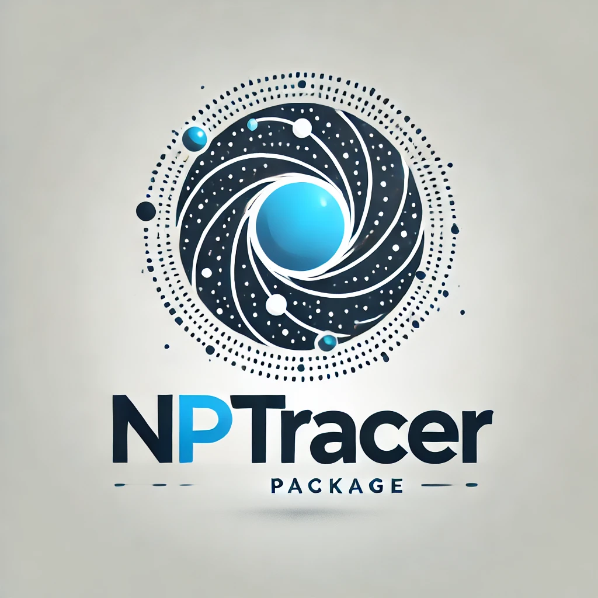

.. Nptracer documentation master file, created by
   sphinx-quickstart on Wed Jul 17 11:01:51 2024.
   You can adapt this file completely to your liking, but it should at least
   contain the root `toctree` directive.
Documentation for Nptracer
====================================

Welcome to Nptracer's documentation!

Nptracer is a Python-based package designed to load output snapshots from 
N-body planet simulations, particularly for ChaNGa and GENGA. 
It facilitates easier data analysis and result visualization!

.. toctree::
   :maxdepth: 2
   :caption: Contents:

   dataLoader.rst
   gengaLoader.rst
   changaLoader.rst
   driver.rst
   dataAnalyzer.rst

Indices and tables
==================

* :ref:`genindex`
* :ref:`modindex`
* :ref:`search`
